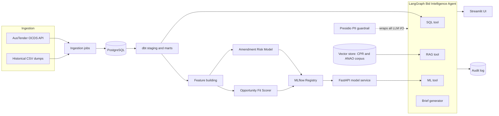

# ProcureLens

**Federal Procurement Intelligence & Bid Agent Platform**

Production-grade ML and agentic AI over Australian Government procurement data (AusTender).
Built as a contract-style engagement for a boutique advisory firm targeting federal work.

> Status: active development — see [Roadmap](#roadmap)

## What it does

1. **Data platform** — ingests 900K+ AusTender contract notices (OCDS API + historical dumps) into PostgreSQL, modelled with dbt and covered by data-quality tests.
2. **Production ML** — two models served behind FastAPI with MLflow registry, calibration, SHAP explainability, scheduled retraining and drift monitoring:
   - *Amendment Risk Model*: probability a contract is later amended upward in value.
   - *Opportunity Fit Scorer*: 0–100 winnability score for new tenders against the firm's capability profile.
3. **Bid Intelligence Agent** — a LangGraph agent with SQL, RAG (Commonwealth Procurement Rules + ANAO reports), and ML tools that answers procurement questions and drafts one-page bid/no-bid briefs.
4. **Government-grade trust layer** — PII redaction guardrail (Presidio), structured audit logging, eval-gated CI, and an AI Use Case Impact Assessment aligned to the Australian Government *Policy for the responsible use of AI in government* (v2.0).

## Architecture



More detail in [docs/architecture.md](docs/architecture.md).

## Repository structure

```
procurelens/
├── src/procurelens/
│   ├── ingestion/        # OCDS API client + historical CSV loader
│   ├── features/         # feature engineering for both models
│   ├── models/           # training pipelines + MLflow registry helpers
│   ├── api/              # FastAPI model service (/predict endpoints)
│   ├── agent/            # LangGraph agent, tools, guardrails, audit log
│   └── monitoring/       # drift reports (Evidently)
├── dbt/                  # staging + marts models with data tests
├── evals/                # golden question set + eval harness (CI gate)
├── tests/                # pytest unit + integration tests
├── ui/                   # Streamlit front end
├── docs/                 # architecture, model card, AI assurance, ADRs
└── .github/workflows/    # CI, weekly ingest, scheduled retraining
```

## Quickstart

```bash
cp .env.example .env          # fill in secrets
docker compose up -d db mlflow
pip install -e ".[dev,ml,etl]"
make ingest-sample            # small OCDS sample for local dev
make dbt-build
make train
make api                      # http://localhost:8000/docs
make ui                       # http://localhost:8501
```

## Production standards

- **CI (GitHub Actions):** ruff → mypy → pytest → **LLM eval gate** → Docker build
- **Model governance:** MLflow registry, calibrated probabilities, SHAP, model card
- **Agent trust:** PII redaction on all LLM I/O, per-step audit trail, prompt-injection defences
- **Evals:** golden set in `evals/golden_set.jsonl`; groundedness + SQL accuracy thresholds block merge
- **Assurance:** [AI Use Case Impact Assessment](docs/ai_assurance_impact_assessment.md)

## Data sources

| Source | Use |
|---|---|
| [AusTender OCDS API](https://github.com/austender/austender-ocds-api) | Contract notices since 2013 (JSON, OCDS schema) |
| [Historical contract data (data.gov.au)](https://data.gov.au/data/dataset/historical-australian-government-contract-data) | Bulk CSV back to 1999 |
| [AusTender weekly exports](https://www.tenders.gov.au/reports/list) | Latest 18 months (XLSX) |
| Commonwealth Procurement Rules + ANAO reports | RAG corpus |

## Roadmap

- [x] Week 1 — architecture, scaffold, ingestion + dbt models
- [x] Week 2 — EDA, features, amendment risk model v1, MLflow
- [ ] Week 3 — FastAPI model service, retraining workflow, fit scorer
- [ ] Week 4 — LangGraph agent (SQL/RAG/ML tools), Presidio guardrail, audit log
- [ ] Week 5 — eval harness, Langfuse, CI eval gate, Docker Compose hardening
- [ ] Week 6 — UI polish, live deploy, model card, assurance doc, demo video

## License

MIT — see [LICENSE](LICENSE).
