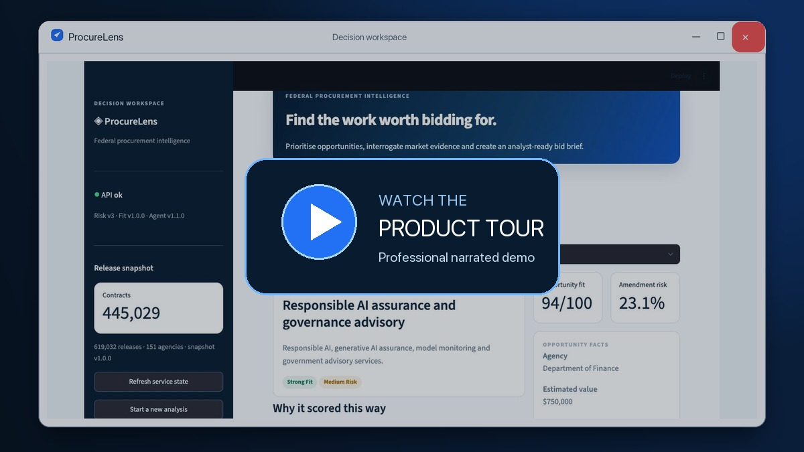
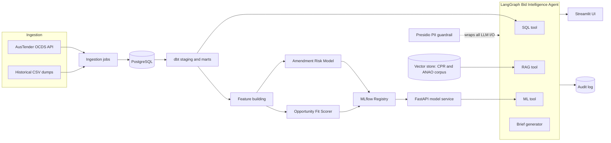

# ProcureLens

**Federal Procurement Intelligence & Bid Agent Platform**

<p align="center">
  <a href="https://github.com/ozzy2438/ProcureLens/releases/download/v1.0.0/PROCURELENS_PROFESSIONAL_DEMO.mp4">
    
  </a>
</p>

<p align="center">
  <strong>▶ Watch the 2:47 professional product tour — narrated, captioned and presented in a Windows application frame</strong>
</p>

Production-grade ML and agentic AI over Australian Government procurement data (AusTender).
Built as a contract-style engagement for a boutique advisory firm targeting federal work.

> **v1.0.0** — deterministic local demo plus an ephemeral Azure acceptance deployment that passed
> production-path smoke tests. Paid resources were removed after verification; see the
> [deployment record](docs/portfolio/azure_deployment_record.md).

## What it does

1. **Data platform** — ingests 619K+ AusTender OCDS releases into PostgreSQL, modelled at 445K unique contracting processes with dbt and covered by data-quality tests.
2. **Production ML** — two models served behind FastAPI with MLflow registry, calibration, SHAP explainability, scheduled retraining and drift monitoring:
   - *Amendment Risk Model*: probability a contract is later amended upward in value.
   - *Opportunity Fit Scorer*: explainable 0–100 fit ranking for new tenders against the firm's capability profile; explicitly not a win probability.
3. **Bid Intelligence Agent** — a LangGraph agent with SQL, RAG (Commonwealth Procurement Rules + ANAO reports), and ML tools that answers procurement questions and drafts one-page bid/no-bid briefs.
4. **Government-grade trust layer** — PII redaction, SHA-256-only Langfuse traces, structured audit logging, Evidently drift reports, eval-gated CI, and an AI Use Case Impact Assessment.

## Architecture



More detail in [docs/architecture.md](docs/architecture.md).

## Repository structure

```
procurelens/
├── src/procurelens/
│   ├── ingestion/        # OCDS API client + historical CSV loader
│   ├── features/         # feature engineering for both models
│   ├── models/           # training pipelines + MLflow registry helpers
│   ├── api/              # FastAPI model service (/predict endpoints)
│   ├── agent/            # LangGraph agent, tools, guardrails, audit log
│   ├── evals/            # deterministic golden-set quality gate
│   └── monitoring/       # safe Langfuse traces + Evidently drift
├── dbt/                  # staging + marts models with data tests
├── evals/                # golden question set + eval harness (CI gate)
├── tests/                # pytest unit + integration tests
├── ui/                   # Streamlit front end
├── data/snapshots/       # versioned 445K-row pseudonymised demo mart
├── deploy/azure/         # Container Apps Bicep and preflight guidance
├── docs/                 # architecture, model cards, assurance, runbooks, portfolio case study
└── .github/workflows/    # CI, weekly ingest, scheduled retraining
```

## One-command demo

Prerequisites: Docker Desktop with Compose v2, 8 GB available memory and about 3 GB free disk.
The deterministic demo does not require a cloud account, OpenAI key or live AusTender connection.

```bash
cp .env.example .env
make demo
```

The command verifies and restores the bundled PostgreSQL snapshot, starts MLflow/API/UI, waits for
dependency-aware readiness, then smoke-tests real SQL, RAG and ML routes. It is idempotent.

| Service | URL |
|---|---|
| Streamlit analyst workspace | `http://127.0.0.1:8501` |
| FastAPI/OpenAPI | `http://127.0.0.1:8000/docs` |
| MLflow | `http://127.0.0.1:5050` |
| PostgreSQL host port | `5433` |

The snapshot contains 445,029 real analytical contract rows but replaces supplier identity and
contract description fields with stable synthetic values; raw release payloads are excluded. The
opportunity feed is a versioned curated demo catalogue, not a claim of live current notices. See the
[operations runbook](docs/runbooks/production_operations.md) for ports, secrets and recovery.

For source development and quality checks:

```bash
pip install -e ".[dev,ml,etl,agent,ui,evals]"
make lint
make test
make dbt-build
make evals
make docker-quality
```

## API examples

Readiness includes release/snapshot identity, loaded registry/profile versions and data counts:

```bash
curl -s http://localhost:8000/health/ready
```

Calibrated amendment risk with SHAP drivers:

```bash
curl -s http://localhost:8000/predict/amendment-risk \
  -H 'Content-Type: application/json' \
  -d '{
    "agency": "Department of Finance",
    "unspsc_category": "81110000",
    "procurement_method": "open",
    "contract_value_aud": 750000,
    "contract_duration_days": 365,
    "supplier_prior_contracts": 3,
    "supplier_prior_amendment_rate": 0.2,
    "supplier_agency_prior_contracts": 1
  }'
```

Explainable opportunity fit ranking:

```bash
curl -s http://localhost:8000/predict/fit-score \
  -H 'Content-Type: application/json' \
  -d '{
    "tender_id": "ATM-001",
    "unspsc_category": "81110000",
    "agency": "Department of Finance",
    "estimated_value_aud": 750000,
    "procurement_method": "open",
    "tender_title": "Responsible AI and machine learning advisory",
    "tender_description": "MLOps, data platform and data governance services",
    "as_of_date": "2026-08-07",
    "close_date": "2026-09-15",
    "agency_recent_tech_spend_aud": 80000000,
    "agency_familiarity_count": 2,
    "supplier_hhi": 0.2
  }'
```

Grounded CPR/ANAO question through the LangGraph agent:

```bash
curl -s http://localhost:8000/agent/query \
  -H 'Content-Type: application/json' \
  -d '{
    "question": "When can an agency use limited tender under the CPRs?",
    "session_id": "demo-rag-1"
  }'
```

ML and brief requests accept structured tool context rather than asking an LLM to invent model
features. A bid brief can include `tender`, `fit_score` and `amendment_risk` payloads:

```bash
curl -s http://localhost:8000/agent/query \
  -H 'Content-Type: application/json' \
  -d '{
    "question": "Create a one-page bid/no-bid brief for this tender",
    "context": {
      "tender": {
        "tender_id": "ATM-001",
        "tender_title": "Responsible AI advisory",
        "agency": "Department of Finance",
        "estimated_value_aud": 750000,
        "procurement_method": "open",
        "close_date": "2026-09-15"
      },
      "fit_score": {
        "tender_id": "ATM-001",
        "unspsc_category": "81110000",
        "agency": "Department of Finance",
        "estimated_value_aud": 750000,
        "procurement_method": "open",
        "tender_title": "Responsible AI advisory",
        "tender_description": "AI, ML engineering and data governance",
        "as_of_date": "2026-08-07",
        "close_date": "2026-09-15"
      },
      "amendment_risk": {
        "agency": "Department of Finance",
        "unspsc_category": "81110000",
        "procurement_method": "open",
        "contract_value_aud": 750000,
        "contract_duration_days": 365
      }
    }
  }'
```

The agent operates without an LLM key using deterministic routing and evidence formatting. When
`OPENAI_API_KEY` is supplied, only final synthesis uses the configured model; all LLM input and
output is PII-redacted and injection-checked. SQL routing and permissions never move to the LLM.

## Evaluation and observability

The versioned golden set contains 45 SQL, RAG, routing, brief and guardrail scenarios. `make evals`
executes the real SQL planner, CPR/ANAO retriever, brief composer and guardrail. The merge gate is
independent of paid APIs and fails below groundedness 0.80, SQL accuracy 0.85, tool routing 0.90 or
guardrail pass rate 1.00. The current baseline is 1.00 on every gate; citation accuracy and brief
quality are also 1.00 informational metrics.

Langfuse is opt-in through `LANGFUSE_TRACING_ENABLED=true` and standard public/secret keys. Trace
input/output is never stored: only SHA-256, byte count, tool type, source count, latency, model,
token usage and calculated cost are exported. `make monitoring-smoke` uses the real Langfuse SDK
with an isolated in-memory exporter and fails if the raw test prompt or PII reaches a span.

Evidently 0.7.21 produces data and prediction drift artefacts locally:

```bash
python -m procurelens.monitoring.drift \
  --reference artifacts/reference.csv \
  --current artifacts/current.csv \
  --output-html artifacts/drift-report.html
```

Docker-contained checks are available with `make docker-quality`. See
[observability and evaluation operations](docs/observability_and_evaluation.md).

## Production standards

- **CI (GitHub Actions):** ruff → mypy → pytest with ≥80% branch coverage → deterministic eval gate → Docker build
- **Model governance:** MLflow registry, calibrated probabilities, SHAP, model card
- **Agent trust:** PII redaction on all LLM I/O, per-step audit trail, prompt-injection defences
- **Evals:** 45-case golden set; groundedness, SQL, routing and guardrail thresholds block merge
- **Observability:** privacy-safe Langfuse traces plus Evidently PSI data/prediction drift reports
- **Assurance:** [AI Use Case Impact Assessment](docs/ai_assurance_impact_assessment.md)
- **Release:** checksum-gated 445K snapshot, dependency-aware health, one-command smoke and
  [revision rollback runbook](docs/runbooks/production_operations.md)

## Portfolio and demo assets

- [Case study](docs/portfolio/case_study.md)
- [3–4 minute demo script](docs/portfolio/demo_script.md)
- [Job application and interview narrative](docs/portfolio/job_application.md)
- [Production release checklist](docs/production_release_checklist.md)
- [Azure Container Apps deployment preflight](deploy/azure/README.md)

## Data sources

| Source | Use |
|---|---|
| [AusTender OCDS API](https://github.com/austender/austender-ocds-api) | Contract notices since 2013 (JSON, OCDS schema) |
| [Historical contract data (data.gov.au)](https://data.gov.au/data/dataset/historical-australian-government-contract-data) | Bulk CSV back to 1999 |
| [AusTender weekly exports](https://www.tenders.gov.au/reports/list) | Latest 18 months (XLSX) |
| [Commonwealth Procurement Rules — 17 November 2025](https://www.finance.gov.au/government/procurement/commonwealth-procurement-rules) | Current procurement rules and thresholds, with PDF page citations |
| [ANAO procurement reports](https://www.anao.gov.au/work/performance-audit) | Contract management, variation and reporting audit findings |

## Roadmap

- [x] Week 1 — architecture, scaffold, ingestion + dbt models
- [x] Week 2 — EDA, features, amendment risk model v1, MLflow
- [x] Week 3 — FastAPI model service, retraining workflow, fit scorer
- [x] Week 4 — LangGraph agent (SQL/RAG/ML/brief tools), Presidio guardrail, audit log, Streamlit
- [x] Week 5 — 45-case eval gate, privacy-safe Langfuse, Evidently drift, ≥80% coverage
- [x] Week 6 — professional UI, pseudonymised snapshot, one-command demo, Azure release config,
  assurance, portfolio case study and demo narrative

`v1.0.0` is prepared locally. Deployment, commit, push and PR creation are intentionally outside
this release-preparation task.

## License

MIT — see [LICENSE](LICENSE).
