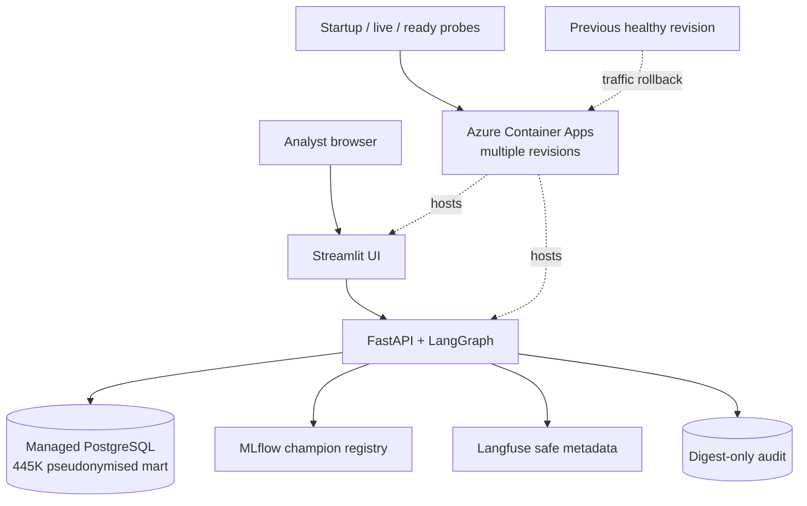

# Architecture

## Design goals

1. **Production over prototype** — every component has tests, versioning, monitoring and a rollback path.
2. **Government-grade trust** — PII redaction, auditability, explainability, human-in-the-loop.
3. **Deliberately small** — one agent with good tools; Docker Compose, not Kubernetes; RAG + tool-use, not fine-tuning.

## Components

### 1. Data platform
- `ingestion/ocds_client.py` pulls OCDS releases from the AusTender API into `raw.contract_notices` (JSONB, idempotent on immutable release `id`; `ocid` is intentionally non-unique so amendments are retained).
- `ingestion/load_historical.py` backfills 1999+ CSV dumps from data.gov.au.
- dbt: `staging` flattens OCDS into typed views; `marts` builds `fct_contracts` (model training grain, amendment outcomes) and `dim_agencies` (spend aggregates). Data tests enforce uniqueness, nullability and value ranges.
- Weekly GitHub Actions ingest keeps data fresh.

### 2. ML layer
- **Amendment Risk Model** — XGBoost + isotonic calibration; time-based split; metrics AUC / PR-AUC / Brier / ECE; calibration and SHAP artefacts logged to MLflow. Registry aliases `champion` and `challenger` drive deployment and comparison.
- **Safe promotion** — every registered candidate becomes `challenger`. It becomes `champion` only when holdout AUC is not lower, Brier is not worse, and ECE is at most 0.05. The compared metrics, reason, and applied decision are written back to the challenger run before the champion alias changes.
- **Opportunity Fit Scorer** — deterministic, versioned 0–100 fit ranking against `config/capability_profile.yml`. It is deliberately not described as a learned win probability.
- **Point-in-time features** — supplier/agency histories use events strictly before the scored award or tender `as_of_date`; future awards cannot contribute to amendment history, spend, familiarity, or HHI.
- **FastAPI serving** — the amendment `champion` and SHAP explainers load once during application startup. `/predict/amendment-risk`, its batch variant, and `/predict/fit-score` use strict Pydantic contracts. `/health` exposes per-model readiness; registry or inference failures return controlled HTTP 503 responses.
- Drift: Evidently 0.7.21 emits HTML and JSON reports for feature and calibrated-prediction
  distributions. PSI ≥ 0.2 marks a column as drifted; reports retain a machine-readable summary.
- XGBoost is pinned to 3.4.0 in both training and serving. The exact version is logged as an MLflow
  parameter and model requirement, preventing cross-version pickle loading warnings.

### 3. Retraining control plane
- `.github/workflows/retrain.yml` runs monthly and through `workflow_dispatch`.
- `dbt build` recreates and tests the training mart before fitting. The training pipeline logs row counts plus a SHA-256 identity for the exact feature snapshot.
- A failed training, logging, or comparison step cannot mutate the champion alias. Metrics and the promotion decision are rendered into the GitHub Actions job summary and retained as a workflow artefact.

### 4. Agent layer
- A single compiled LangGraph routes `guard_input → route → one governed tool → respond`.
  Routing is deterministic and allowlisted, so an LLM cannot grant itself a tool or broaden SQL scope.
- **SQL tool:** parses one PostgreSQL statement with sqlglot, permits only query ASTs, rejects
  non-allowlisted schemas/tables and sensitive PostgreSQL functions, then executes inside a
  read-only transaction with a 5-second timeout and a 200-row cap. Production credentials should
  use the `agent_readonly` role in addition to these application controls.
- **RAG tool:** retrieves from a versioned local corpus of the Department of Finance's
  *Commonwealth Procurement Rules — 17 November 2025* and selected ANAO procurement reports.
  TF-IDF retrieval is deterministic and network-independent; every chunk contains document,
  printed page, section and official PDF URL metadata. Retrieved text is treated as untrusted data.
- **ML tool:** calls the existing `/predict/amendment-risk` and `/predict/fit-score` service
  contracts with bounded HTTP timeouts and controlled failures.
- **Brief tool:** combines tender context, model signals, dbt-mart evidence and governance sources
  into a deterministic one-page recommendation. Missing evidence remains explicit and the brief
  is marked **DRAFT — analyst review required** at both the start and end.
- `/agent/query` exposes the graph through the existing FastAPI service. The Streamlit client at
  port 8501 supports chat, structured JSON tool context, page-level sources and draft download.

### 5. Trust layer
- Presidio uses its pattern recognisers with a no-op NLP engine, avoiding a runtime model download;
  deterministic AU phone, ABN and TFN patterns run first as a fail-safe. URL entities are excluded
  so official citations remain intact.
- User questions, nested context, retrieved chunks, tool evidence and LLM responses cross the same
  PII/injection boundary. Instruction-override patterns block the request or tool output before use.
- Append-only JSONL audit records are mode `0600` and contain timestamp, session, step, status,
  tool, latency, sources and SHA-256 input/output digests. Raw prompts and PII are not retained.
- LLM synthesis is optional. With no API key the graph returns deterministic tool evidence; with a
  key, the guarded tool result is sent to the configured chat model and the response is guarded
  again. SQL authority and routing remain outside the LLM.
- Langfuse observations are nested under one agent trace. Exported input/output fields contain only
  SHA-256 fingerprints and byte counts; approved metadata is limited to route/tool status, latency,
  source count, model, token usage and calculated cost. A defence-in-depth SDK mask hashes any
  unexpected payload. Tracing failures never change an agent decision.
- The 45-case deterministic harness invokes the production SQL planner, RAG retriever, router,
  brief composer and guardrail. Extractive RAG answers are grounded only when expected source IDs
  are retrieved, expected claims are present and every answer passage equals a retrieved chunk.
  CI gates groundedness ≥0.80, SQL accuracy ≥0.85, routing ≥0.90 and guardrails at exactly 1.00.
- Evidently PSI reports compare reference and current feature/prediction batches and export HTML,
  full JSON and a compact summary for monthly monitoring and workflow artefacts.

### 6. Release and presentation layer

- The Streamlit experience has four governed flows: a curated and clearly labelled opportunity
  feed, model decision workspace, agent copilot, and downloadable bid/no-bid brief/evidence pack.
  It displays source URLs, model versions and the mandatory draft warning at the point of use.
- `data/snapshots/procurelens-marts-v1.0.0.dump` is a PostgreSQL 16 custom-format archive of the
  445,029-row analytical mart. Supplier identifiers are pseudonymised, supplier names and
  descriptions are synthetic, and raw OCDS releases are excluded. Restore verifies SHA-256 and
  row count before an atomic schema swap.
- `make demo` is the clean-environment entry point. It starts PostgreSQL and MLflow, restores the
  snapshot, builds API/UI images, blocks on dependency-aware readiness, then exercises real SQL,
  RAG and ML routes.
- API liveness answers only for the process; readiness additionally requires amendment champion,
  fit scorer, agent and snapshot. This separation prevents an empty database or missing registry
  from receiving traffic.
- Azure Container Apps templates define separate API/UI apps, Log Analytics, immutable image tags,
  secret references, managed identities, startup/liveness/readiness probes and multiple revisions.
  Managed PostgreSQL and MLflow remain explicit external dependencies; they are not hidden inside
  an ephemeral app container.

## Environments

| Env | Runtime | Notes |
|---|---|---|
| dev | Python + existing PostgreSQL | development, training and dbt exploration |
| demo | Docker Compose | versioned Postgres snapshot + MLflow + API + UI; deterministic one-command run |
| quality | Docker Compose profile | eval gate and isolated Langfuse/Evidently smoke |
| prod candidate | Azure Container Apps | separate API/UI revisions, managed Postgres/MLflow, secret references; template validated but not deployed |

## Threat model highlights

- Injection via tender documents (RAG corpus) → tool-output sanitisation + injection flags.
- Data exfiltration via SQL tool → read-only role, schema allowlist, row caps, audit log.
- Model misuse → calibrated probabilities with bands, never raw scores presented as certainty.
- Audit-log sensitivity → no raw prompts, restricted file mode and digests only.
- Demo data mistaken for current procurement opportunities → `DEMO-` identifiers, visible curated
  scenario disclaimer and official AusTender search link.
- Partial or corrupt snapshot → checksum and exact-count verification before transactional swap.
- Failed cloud revision → readiness blocks traffic and previous active revision remains available.
