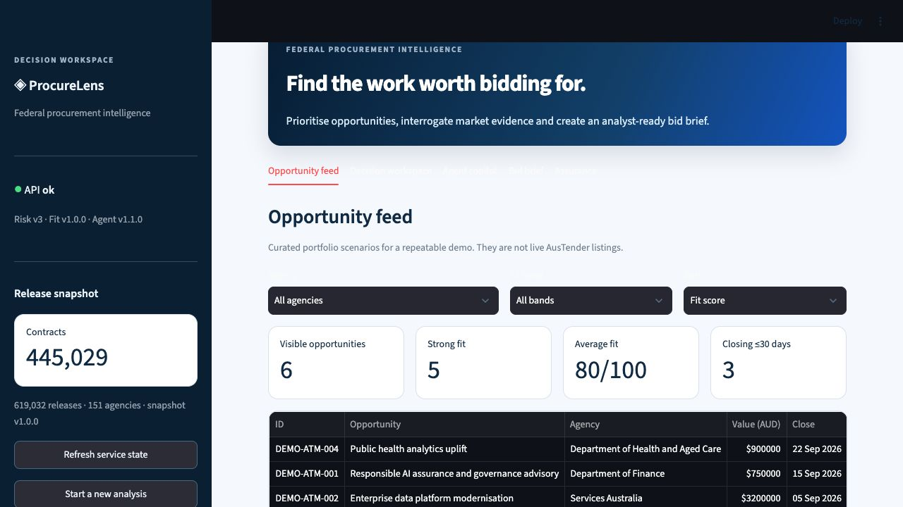
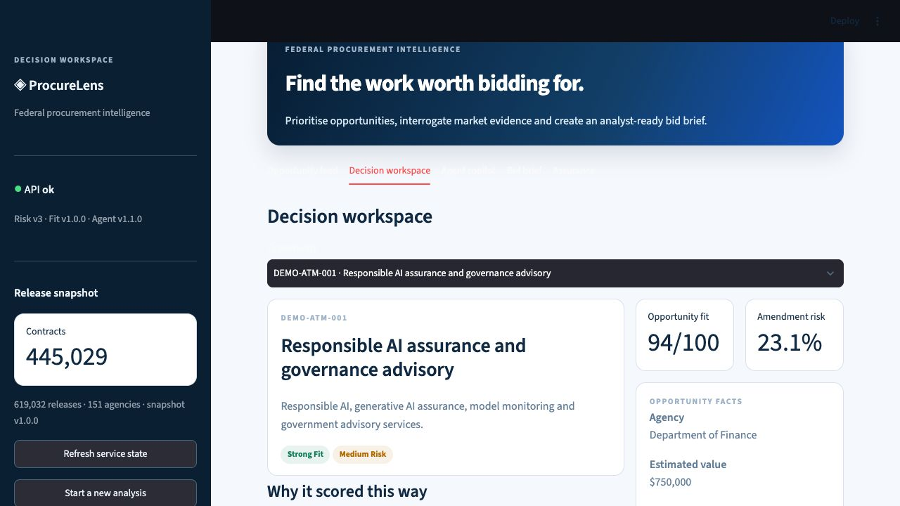
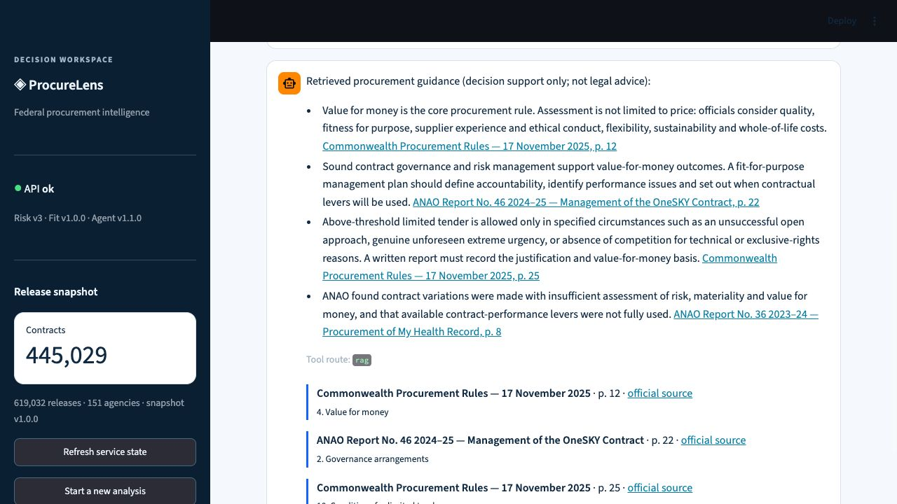
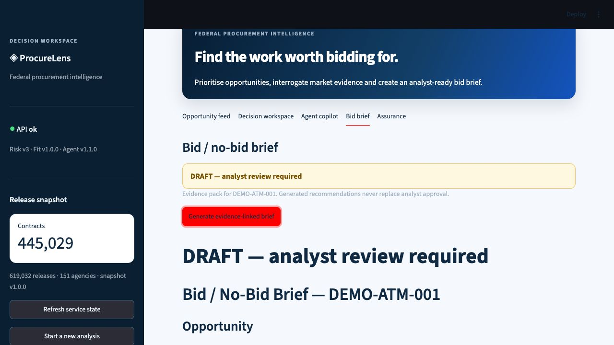

# ProcureLens — Federal Procurement Intelligence That Can Defend Its Answer

## The brief

A boutique AI advisory firm cannot manually inspect every AusTender release, compare agency and
supplier history, interpret procurement rules and prepare a defensible bid decision before closing.
The portfolio brief was therefore not “build a chatbot.” It was to demonstrate the full engineering
discipline expected of a government-facing GenAI consultancy: reproducible data, calibrated ML,
grounded agent tools, privacy controls, eval gates, observability and an operable release.

## What I built

ProcureLens turns Australian Government procurement data into four connected analyst workflows:

1. a scored opportunity feed against a versioned AI/data advisory profile;
2. calibrated amendment-risk triage with human-readable SHAP drivers;
3. a single LangGraph agent that safely routes SQL, procurement-rule RAG and model calls; and
4. a cited, downloadable bid/no-bid brief that is always marked for analyst review.

The demo catalogue is deliberately labelled as curated portfolio scenarios. It exercises production
contracts repeatably without implying that an example is a current live tender.

## System and evidence

| Layer | Production evidence |
|---|---|
| Data | 619,032 immutable releases → 445,029 unique OCIDs; dbt 23/23 |
| Amendment risk | temporal holdout; AUC 0.8664, PR-AUC 0.6568, Brier 0.1042, ECE 0.0316 |
| Fit ranking | deterministic 0–100 policy with versioned weights and positive/negative reasons |
| Agent | SELECT-only SQL, cited CPR/ANAO retrieval, ML tools and deterministic draft brief |
| Safety | Presidio redaction, prompt-injection rejection, digest-only audit and Langfuse traces |
| Evaluation | 45 golden cases; all four CI gates at 1.00 against required thresholds |
| Engineering | branch coverage above 80%, XGBoost 3.4 native-compatible serving, Docker release |

## The hard engineering decisions

### 1. Amendment identity before modelling

`ocid` is a contracting-process key, not a unique release key. Preserving multiple releases per
OCID was necessary to observe explicit `contractAmendment` events; deduplicating on OCID at ingest
would have deleted the target. The raw table is idempotent on immutable release ID, while dbt owns
the contract-grain target logic.

### 2. Point-in-time features and a temporal holdout

Supplier history, agency familiarity, spend and concentration use only events published before the
scored date. Training uses awards through 2023 and holds out 2024–2025. This is less flattering
than a random split but simulates the real decision boundary and makes the score defendable.

### 3. Calibration and safe promotion over headline AUC

The model is an operational probability, so Brier and ECE matter alongside ranking. A challenger
with slightly better AUC/ECE was rejected because Brier worsened. Promotion is an atomic alias
change only after all non-regression gates pass.

### 4. One governed agent, not a swarm

Routing and SQL authority are deterministic and allowlisted. The LLM, when enabled, may synthesize
approved evidence but cannot select a broader schema or upgrade permissions. This keeps the trust
boundary small enough to test and explain.

### 5. Honest fit ranking

No firm bid/outcome labels exist, so ProcureLens never calls the fit score a win probability. The
version-one policy makes assumptions visible: category/keyword fit, value range, agency spend and
familiarity, HHI, procurement method and lead time.

## Release design

The release package contains a 445,029-row PostgreSQL 16 analytical snapshot with stable synthetic
supplier labels rather than raw supplier identity. A single command verifies its SHA-256, restores
to a temporary schema, checks the exact count, swaps it transactionally, starts MLflow/API/UI and
runs real SQL, RAG and ML smoke checks.

Azure Container Apps Bicep separates API and UI, references secrets, uses immutable tags and
startup/liveness/readiness probes, and retains multiple revisions for a traffic-only rollback. The
configuration is compile-validated but intentionally not deployed as part of the local portfolio
release.

## Responsible AI posture

ProcureLens is decision support. It cannot take procurement action and every generated brief is a
draft. RAG passages retain document/page/section/URL evidence. PII is redacted at every optional LLM
boundary, injection patterns are rejected, and observability contains digests/metadata rather than
raw prompts. The AI assurance assessment mirrors the Australian Government AI policy v2.0 and
National Assurance Framework while explicitly requiring an adopting agency to perform its own
assessment.

## Result

The outcome is a compact but end-to-end production story: source-to-mart lineage, leakage-aware ML,
registry governance, explainable agent routing, privacy-safe telemetry, release gates, a repeatable
live demo and rollback documentation. The strongest result is not a perfect metric; it is that every
score and generated recommendation has an evidence path, a version and a human decision owner.
